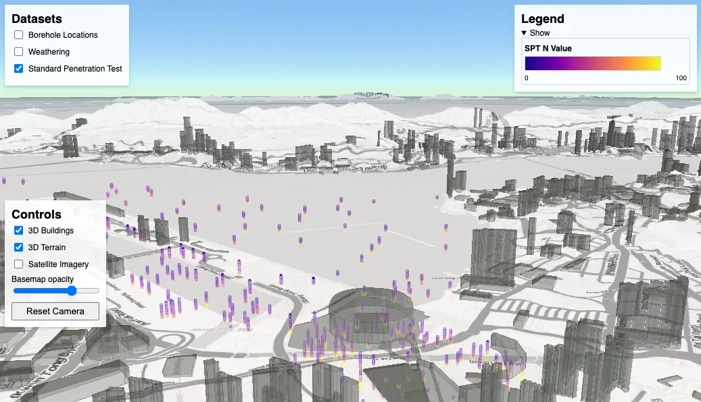
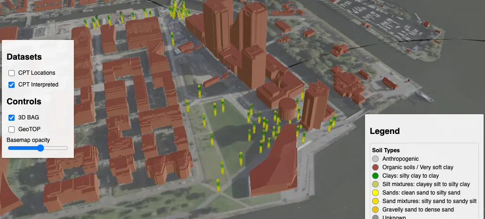

import { Card } from '@astrojs/starlight/components';

<Card title="<a href='/examples/hong-kong/'>GI Data in Hong Kong </a>">
    3D geospatial ground investigation in Kai Tak, Hong Kong using CesiumJS, Speckle, and ArcGIS online

{/*      */}
    
</Card>

<Card title="<a href='/examples/nl-amsterdam-noord-cpt/'>Amsterdam Noord - CPT Webmap</a>">
    Interactive 3D visualization of Cone Penetration Test data with soil type interpretations, 3D Buildings, and a 3D geological block model.

    
</Card>

<Card title="<a href='/examples/ground-model/'>GI Data & Ground Model</a>">
    GI data, the derived Leapfrog ground model, and a tunnel in Speckle.

    
</Card>