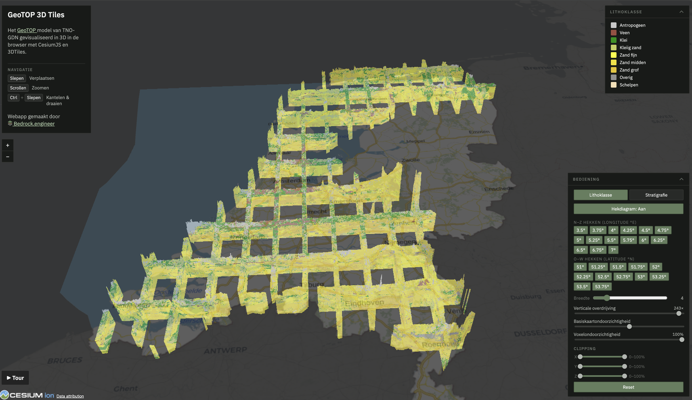

**Project:** GeoTOP 3D Tiles, a browser-based voxel viewer of the Dutch subsurface\
**Live:** [geotop.bedrock.engineer](https://geotop.bedrock.engineer/)\
**Author:** Jules Blom, [Bedrock.engineer](https://bedrock.engineer)\
**Platform:** CesiumJS (1.139), 3D Tiles (`3DTILES_content_voxels`)

<video src="/voxels-og.mp4" autoplay muted loop playsinline controls style="width: 100%; border-radius: 0.5rem;">
  A demo of the GeoTOP viewer: orbiting the voxel model of the Netherlands and slicing it into fence-diagram cross-sections.
</video>

## Narrative

### The goal

[GeoTOP](https://basisregistratieondergrond.nl/inhoud-bro/registratieobjecten/modellen/geotop-gtm/)
is the Geological Survey of the Netherlands' (TNO-GDN) voxel model of the
shallow Dutch subsurface: roughly 910 million voxels at 100 m × 100 m × 0.5 m
resolution, classifying lithology and stratigraphy down to ~50 m depth.
It is open data, yet effectively hard to access for most of its potential
audience, because using it requires downloading a 1.8 GB NetCDF file and
desktop GIS or scientific tooling like Kitware Paraview.

The goal of this project was to make the _entire national model_ explorable by
anyone with a browser link. We stream it as 3D Tiles voxels and render it with
CesiumJS. Additionally we add intuitive interactions that most users need,
like toggling between lithology or stratigraphy, per-unit visibility, making
cross-sections, and clipping.

Voxels are one of the newest and least-documented corners of the 3D Tiles /
CesiumJS ecosystem (`3DTILES_content_voxels` is experimental; the
`VoxelPrimitive` + `CustomShader` API surface is barely documented).

### How it started

The project has its roots in the [AEC Hackathon Zürich](https://opensource.construction/events/aec-hackathon-zurich/)
(opensource.construction, February 2025), where our team built an
["underground voxel viewer for laymen"](https://github.com/Duke-of-Lizard/underground-voxel-viewer-for-laymen).
We tried to bring a geophysical survey dataset ([Emerald Geomodelling FRE16](https://www.emerald-geomodelling.com/news/fre-16), an airborne
electromagnetic survey along a Norwegian potential rail corridor) to
non-expert decision-makers in the browser. ([3DTiles Voxel Demo](https://emerald-sensitive-clay.bedrock.engineer/))

The idea was that voxels represent the subsurface better than solid models,
because they can carry heterogeneity and uncertainty. But we struggled to get
the dataset into any voxel format a web viewer could actually render. We ended
up (ab)using 3D Tiles point clouds in CesiumJS.

Shortly after the hackathon I noticed the first signs of the voxel API
surfacing in CesiumJS releases. Then in the summer of 2025 we spoke with the
Province of Zeeland at FOSS4G NL. They told us they were struggling to show
GeoTOP in their CesiumJS-based digital twin. This reminded me of the hackathon
and the nascent voxel API in Cesium.

Later that year I started experimenting with `VoxelPrimitive`, I
worked out the data side (the NetCDF → 3D Tiles voxels converter) and the
rendering side (custom shaders). I got a basic demo working with small
cutouts of GeoTOP. Later, I got the full GeoTOP at national scale working.
It solves the problem our hackathon team couldn't crack in a weekend, and the
one the Province of Zeeland asked about that summer.

### The steps

1. **Data pipeline (NetCDF → 3D Tiles voxels).** We built a Python conversion
   pipeline that turns the GeoTOP NetCDF into a 3D Tiles voxel tileset:
   sparse stratigraphy codes remapped to contiguous `UINT8` indices, the grid
   reprojected from the Dutch RD New CRS (EPSG:7415) onto a regular WGS84
   grid using pyproj, and octree tiling with meshopt-compressed glTF output (5 levels, 1278 tiles for the full
   country). The tileset ships with a small generated **data contract** of
   `schema.json` (property types), `legend.json` (labels + colors) and
   `remap.json` (original codes → indices), that the frontend consumes to create shader and legend UI elements.
2. **The viewer (CesiumJS).** A static web app that loads the
   tileset with `Cesium3DTilesVoxelProvider` / `VoxelPrimitive` and does all
   styling in a `CustomShader`:
   - Decode convention: nearest-sampled normalized `UINT8` metadata is
     converted back to a class index in the fragment shader and looked up in
     a colormap array built from `legend.json`.
   - [Underground viewing](https://cesium.com/blog/2020/06/16/visualizing-underground/): translucent globe, camera collision off, depth
     handling tuned so users can dive below the terrain and look up at the
     geology.
   - Interactions implemented in the shader via uniforms: per-class visibility toggles, global opacity, X/Y/Z slab
     clipping, and fence-diagram cross-sections; plus a scripted camera demo.
3. **Serving and operations.** Tiles are hosted on Cloudflare R2 behind
   `r2.eu.bedrock.engineer`; the app deploys as Cloudflare Workers static
   assets. Tileset names encode the recipe and model version so a new GeoTOP
   release can roll out side-by-side with the old one.
4. **Debugging Cesium itself.** With the voxel API surface this new, some of
   the work meant going into Cesium's own source. This led to me finding a small bug and merging an [upstream bugfix in CesiumJS](https://github.com/CesiumGS/cesium/pull/13257)

### Challenges and solutions

| Challenge                                                                                                                                       | Solution                                                                                                                                                                           |
| ----------------------------------------------------------------------------------------------------------------------------------------------- | ---------------------------------------------------------------------------------------------------------------------------------------------------------------------------------- |
| The voxel format and API were barely documented: `3DTILES_content_voxels` is experimental, and there is little beyond a few Sandcastle examples. | Unraveled the Sandcastle examples and dug deep into the 3D Tiles voxel spec and Cesium's source to work out the tileset layout, the metadata decode convention, and the shader API. |
| Cesium maps voxel data linearly into an ellipsoid region, which smears the projected national grid (RD New) by up to ~8 km.                      | Resample onto a regular WGS84 grid during conversion, using the NSGI PROJ grids for accurate datum transformation.                                                                  |
| ~910 million voxels can't ship as one payload.                                                                                                  | Apply octree tiling: 5 levels, all-nodata tiles dropped from the availability bitstream, meshopt-compressed glTF, so we have tiles that stream by level of detail.                  |
| Toggling one of the 72 stratigraphy classes would mean recompiling the shader on every legend click.                                            | Hidden classes live in bitmask uniforms the fragment shader tests per voxel. 72 classes exceed one int's 31 usable bits, so the mask spans an `ivec4`. Toggles are instant.         |
| Underground viewing: the camera and depth handling fight the globe surface.                                                                     | Globe translucency with distance-based alpha, collision detection off, depth-test configuration so users can dive below the surface and look up at the geology.                     |
| No WebGL 2, or context creation fails (enterprise rules blocklisting GPU).                                                                      | Detect both cases and show a friendly fallback card instead of a Cesium error dialog. Data-load failures get the same treatment.                                                    |

### The result

A public viewer at [geotop.bedrock.engineer](https://geotop.bedrock.engineer/)
where anyone can view GeoTOP interactively. The full national model
streams progressively at every zoom level; all styling and slicing runs
client-side in one shader, so toggling a stratigraphic formation or dragging
a cross-section plane is instant. The UI is in Dutch, matching its primary
audience.

We are also working on integrating GeoTOP 3D Tiles voxels into the Province of Zeeland's
digital twin, the LEIA Viewer.



### Next steps / future work

- **GeoTOP v1.7 (Oost-Nederland).** TNO announced the eastern Netherlands
  model area in July 2026; the data is not yet distributed. The pipeline is
  verified end-to-end against v1.6.1 and ready to convert and roll out the
  new release the moment it lands.
- **Voxel picking precision.** So far, we haven't got this working reliably;
  see step 4 above for the root cause and mitigations.
- **More models.** The viewer components are dataset-agnostic by design;
  other voxel models (or non-geological gridded data) are natural follow-ups.

## Architecture

### System overview



### Selected code

All styling and interaction happens in one `CustomShader` on the
`VoxelPrimitive`. Three representative pieces:

**Metadata decode.** Voxel metadata arrives as normalized `UINT8`; the
fragment shader recovers the class index, discards no-data, and colors:

```glsl
void fragmentMain(FragmentInput fsInput, inout czm_modelMaterial material) {
  float litho = fsInput.metadata.lithology * 255.0;
  if (litho > 254.0) {          // 255 = nodata
    material.alpha = 0.0; return;
  }
  // ... colormap lookup generated from legend.json ...
  material.diffuse = color;
  material.alpha = u_opacity;
}
```

**Per-class visibility without recompiles.** The naive approach rebuilds the
`CustomShader` every time a user hides a formation in the legend. Instead,
visibility lives in an integer bitmask uniform: one bit per class, tested by
the fragment shader against the voxel's class index. A legend toggle is then
a single uniform update. Stratigraphy has 72 classes, and JavaScript bitwise
operators work on 32-bit signed integers (31 usable bits), so the mask spans
four words: a `Cartesian4` on the JS side, an `ivec4` uniform in GLSL:

```js
// JS side: word = index >> 5, bit = index & 31
function stratHiddenMask() {
  const words = [0, 0, 0, 0];
  for (const index of hiddenStratIndices) {
    if (index >= 0 && index < 128) words[index >> 5] |= 1 << (index & 31);
  }
  return new Cesium.Cartesian4(words[0], words[1], words[2], words[3]);
}
```

```glsl
// GLSL side: pick the word, then test the bit within it
int si = int(strat + 0.5);
int maskWord = (si >> 5) == 0 ? u_hiddenStratMask.x
             : (si >> 5) == 1 ? u_hiddenStratMask.y
             : (si >> 5) == 2 ? u_hiddenStratMask.z
             :                  u_hiddenStratMask.w;
if ((maskWord & (1 << (si & 31))) != 0) {
  material.alpha = 0.0; return;
}
```

**Fence-diagram cross-sections.** A fence diagram reduces the voxel volume
to thin vertical walls, the classic way geologists read a layer stack. Each
fence is a wall at a chosen longitude (north–south) or latitude (east–west).
The fragment shader recovers the fragment's world position, converts it to
longitude and latitude, and keeps the fragment only if it lies within a
small angular half-width of an active fence; everything else is made
transparent. Because the test runs in geographic coordinates, a fence
follows a meridian or parallel exactly, independent of the projected RD New
grid the data started in. Adding or moving a fence regenerates one
comparison per plane in the shader:

```glsl
vec3 posWC = (czm_inverseView * vec4(fsInput.attributes.positionEC, 1.0)).xyz;
float lon = atan(posWC.y, posWC.x);
float lat = asin(clamp(posWC.z / length(posWC), -1.0, 1.0));

// generated per active plane: abs(lon - <plane lon>) < <half-width>
if (!(abs(lon - 0.0925025) < 0.0000157)) {
  material.alpha = 0.0; return;
}
```

### How Cesium supports the project

The project exists because CesiumJS is the only web engine that can show
massive voxel datasets in geospatial context. 3D Tiles is what makes
streaming a national-scale voxel grid feasible. 
GeoTOP becomes more meaningful in geographic context, and Cesium provides the terrain, imagery draping, and underground
camera work that situate the geology under the real landscape.
With `CustomShader`, every interaction (coloring, visibility, clipping, cross-sections) runs client-side.

### Advanced features demonstrated

- **Metadata styling**: all voxel coloring is metadata-driven in
  `CustomShader`: `UINT8` class decode, legend-derived colormaps, and
  per-class visibility bitmasks evaluated per fragment.
- **Advanced camera control**: underground navigation (collision detection
  off, translucent globe), `flyToBoundingSphere` on load, and a scripted
  camera tour.
- **Intuitive UI tied to 3D Tiles**: legend toggles, fence-diagram planes,
  slab clipping and opacity all drive live shader uniforms on the voxel
  tileset, with no reloads or recompiles.
- **API integration**: PDOK (Dutch national geo-services) WMTS basemap,
  Carto imagery, and 3D Tiles streamed from Cloudflare R2.

The following sandcastles were essential in understanding how the voxels work inside CesiumJS.

- [Voxels](https://sandcastle.cesium.com/standalone.html?id=voxels)
- [Voxels in 3d tiles](https://sandcastle.cesium.com/standalone.html?id=voxels-in-3d-tiles)
- [Voxel picking](https://sandcastle.cesium.com/standalone.html?id=voxel-picking)


## Credits and data attribution

- **GeoTOP model**: TNO Geological Survey of the Netherlands (TNO-GDN),
  distributed as open data through the Basisregistratie Ondergrond (BRO).
- **CesiumJS** and the 3D Tiles open standard, CesiumGS.
- **Basemaps**: BRT achtergrondkaart via PDOK (Dutch national geo-services);
  Carto light basemap with OpenStreetMap contributors' data.
- **Hosting**: Cloudflare Workers (app) and R2 (tiles).
